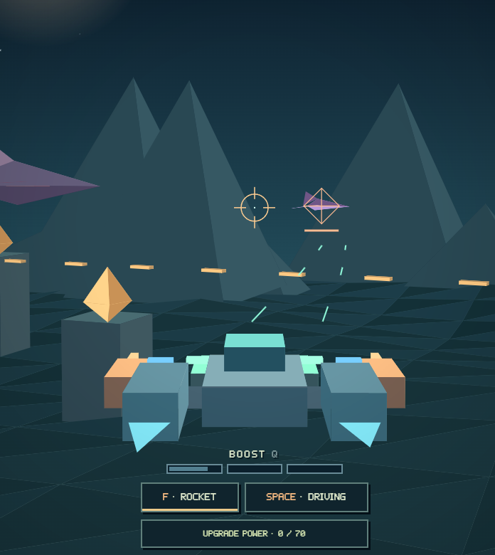
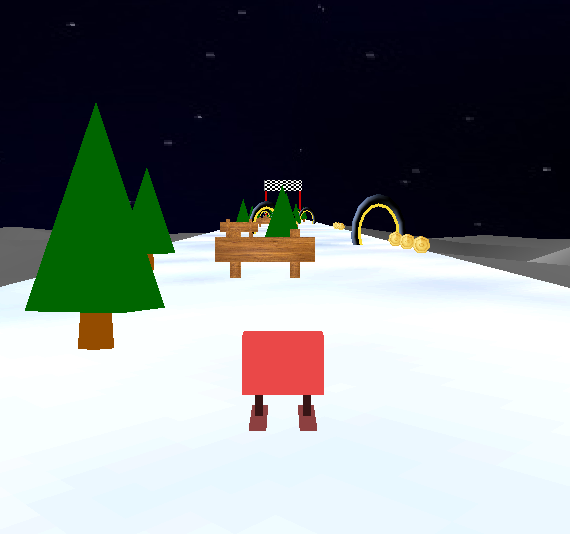
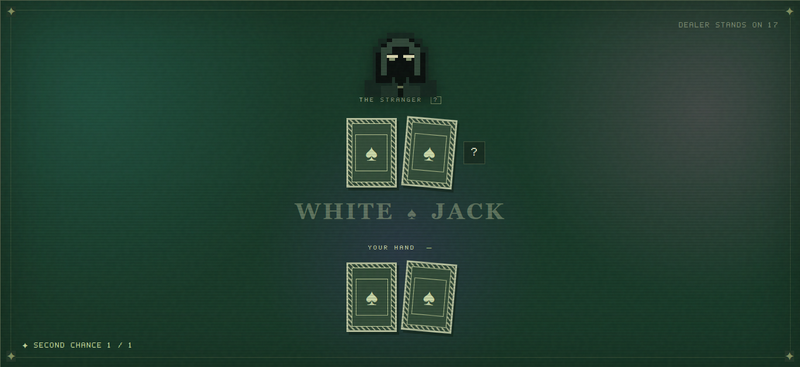

# Game Studio

A small collection of games called Game Studio. There are three playable prototypes: **Skyrush**, an arcade flight and tower-defense game, **Slopedown**, a fast slope-descent platformer, and **White Jack**, a pixel-art blackjack roguelike.

<table width="100%">
  <tr>
    <td width="100%" valign="top">
      
      <h2>Skyrush</h2>
      <p>A tower defense game, where you are the "tower". Upgrade your ship and stop 10 increasingly difficult waves from passing through.</p>
    </td>
  </tr>
  <tr>
    <td width="100%" valign="top">
      
      <h2>Slopedown</h2>
      <p>Control your snowboarder down a course, collect coins, hit boost-gates and finish the run as quickly as possible.</p>
    </td>
  </tr>
  <tr>
    <td width="100%" valign="top">
      
      <h2>White Jack</h2>
      <p>Face an anonymous dealer, collect charms, and turn the odds in your favor. Experiment with different builds and approaches. Can you reach the last depth?</p>
    </td>
  </tr>
</table>

# Play
Play the games here: <a href="https://marth1703.github.io/GameStudio/">https://marth1703.github.io/GameStudio/</a>

## Run locally

No package installation is required. From this folder, start a local static server:

```text
python -m http.server 8080 --bind 127.0.0.1
```

Then open [http://127.0.0.1:8080/](http://127.0.0.1:8080/) and choose a game from the launcher. White Jack requires HTTP serving for JavaScript modules and its background worker; use the local server or GitHub Pages rather than opening its file directly. VSCode's Live Server is suitable too.

## Status

This game is a prototype, but still needs more development time to be considered a full working game.

